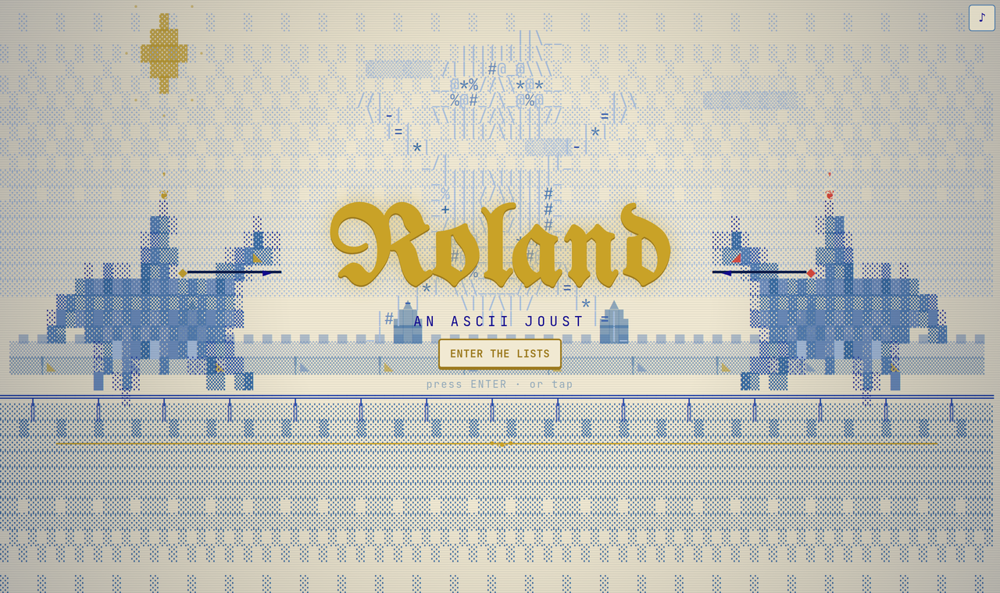
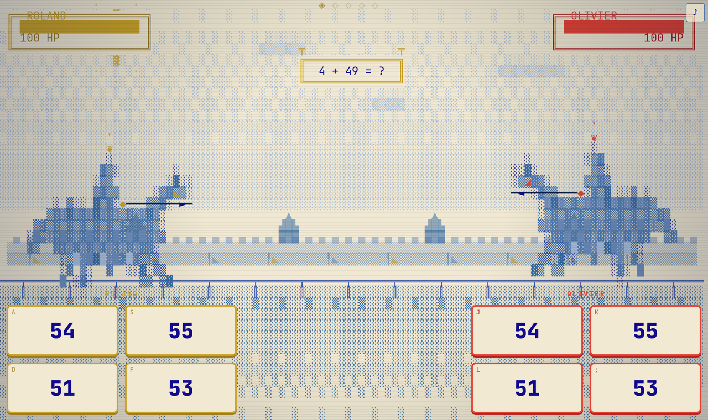
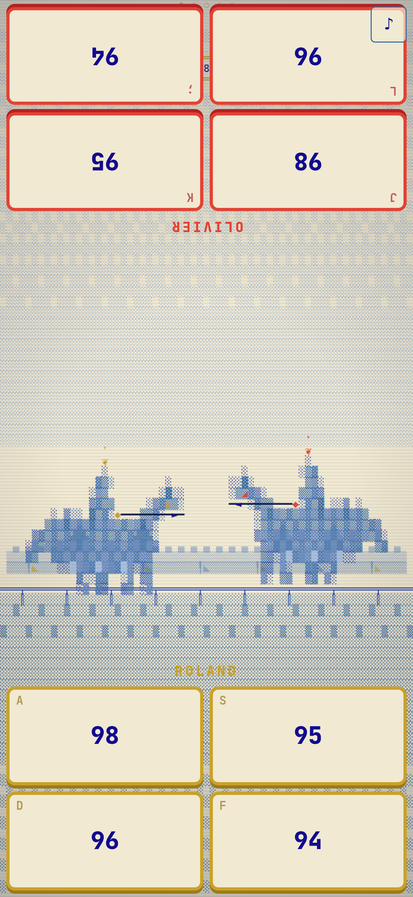

# ⚔ Roland — an ASCII joust

A beautiful **blue‑duotone, dithered‑ASCII** jousting duel where two knights
charge by **answering arithmetic faster than each other**. Built to feel like an
illuminated medieval manuscript rendered on a phosphor terminal — and to play
well on **both phones and desktops**.

> _Two knights. One tilt. The quicker mind unhorses the other._



| Desktop tilt | Phone (head‑to‑head) |
| --- | --- |
|  |  |

## How it plays

- A match is **best of N rounds** (3 / 5 / 7). Each round is one **tilt** down the lists.
- Both knights see the **same problem**. The first to tap the **correct** answer
  wins the exchange and **gallops a stride** toward the centre.
- A **wrong** answer locks you out of that exchange — your foe can seize it.
- Reach the centre first to **land the blow**. Damage scales with your **lead**,
  your **speed**, and a **clean ride** (no mistakes) lands a **critical**.
- Drop a knight to **0 HP** to unhorse them early, or have the most HP after the
  final round. Ties go to **sudden death**.

### Controls

|              | Player 1 (gold) | Player 2 (vermilion) |
| ------------ | --------------- | -------------------- |
| Keyboard     | `A` `S` `D` `F` (or `1`–`4`) | `J` `K` `L` `;` (or `7`–`0`) |
| Touch        | tap the four answer tiles | tap the four answer tiles |
| Advance / start | `Enter` / `Space` / tap | — |

- **Two Knights** — local 2‑player on one device. On a phone in portrait the
  board is split head‑to‑head (Player 2’s pad is rotated to face them across the
  table); in landscape the pads sit left/right.
- **Vs Squire AI** — solo practice against a bot (`Squire` / `Knight` / `Champion`).

## Run it

```bash
npm install
npm run dev        # http://localhost:5173
```

Production build (static — host anywhere):

```bash
npm run build      # -> dist/   (drop on Vercel, GitHub Pages, Netlify, …)
npm run preview
```

Single self‑contained file you can double‑click (keep the `fonts/` folder next to it):

```bash
npm run build:single   # -> dist/index.html
```

Run the tests:

```bash
npm test
```

## Make your own ASCII art

The game ships a procedurally‑generated knight and a built‑in heraldic emblem,
but you can bake **any** picture into the same dithered‑ASCII look:

```bash
# drop reference images into raw-art/  (png / jpg / webp)
npm run gen:art
```

Each image becomes `src/assets/art/<name>.json` and is picked up automatically
by `src/render/art.ts`. The baker (`scripts/gen-ascii.mjs`) does luminance →
ordered (Bayer) dithering → character‑ramp mapping, with optional Sobel edge
glyphs — the same pipeline the in‑game knight rasteriser uses.

## Visual direction

A strict **blue‑on‑cream duotone** for the dithered scene (deep ultramarine ink
on parchment), with **gold** and **vermilion** held back as the two illuminated
accent pigments — they distinguish Player 1 from Player 2 and mark crits and
victories. Display type is blackletter (UnifrakturMaguntia); the grid is
JetBrains Mono. Fonts are **self‑hosted** (no network, works offline).

## Tech

- **Vite + TypeScript (strict)**, zero runtime dependencies.
- Hand‑rolled fixed‑timestep loop with render interpolation; pure, unit‑tested
  game logic (`src/game/`); a single normalized input controller (keyboard +
  Pointer Events); Canvas2D ASCII renderer with ordered dithering, block‑shade
  meters, box‑drawing frames, a character particle pool, trauma screen‑shake and
  a CRT/scanline pass; procedural WebAudio SFX + a looping medieval theme.

```
src/
  core/     loop · input · audio · easing · math
  game/     problems · match · ai · engine   (pure logic is unit‑tested)
  render/   screen · palette · frame · sprites · knightgen · raster · arena · …
  ui/       responsive HTML overlay (menus + answer pads)
scripts/    gen-ascii.mjs   (offline image → dithered ASCII baker)
```

## Roadmap

- Online 2‑player over a lightweight realtime channel (WebRTC / WS).
- More customisation (heraldry, palettes, problem types: fractions, sequences).
- Power‑ups & special tilts; tournament ladder.

---

Made with care for the craft of ASCII. _Couch your lance._
